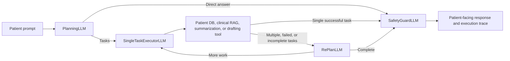
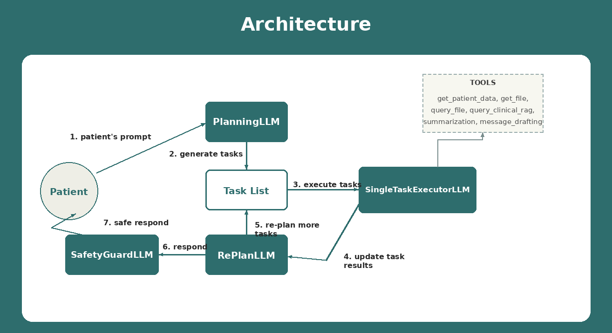

# CarePilot

CarePilot is a patient-facing AI agent that brings together medical records, care logistics, and source-attributed clinical information. It helps patients understand documents in plain language, prepare for appointments, check referral or insurance status, and draft messages to their care team.

> **Live Web UI:** [https://care-pilot-dun.vercel.app](https://care-pilot-dun.vercel.app)
>
> **Interactive API documentation:** [https://care-pilot-dun.vercel.app/docs](https://care-pilot-dun.vercel.app/docs)

The public submission opens directly with the synthetic `patient_1` profile. No login or real patient information is required.

## What CarePilot Can Do

- Answer questions grounded in the current patient's uploaded records.
- Search appointments, lab summaries, referrals, insurance letters, and other patient documents.
- Retrieve source-attributed clinical reference material from Pinecone.
- Summarize source text without adding a diagnosis or unsupported medical advice.
- Draft factual messages for care coordination, referrals, insurance, and record requests.
- Show the agent's planner, executor, replanner, and safety-review trace.
- Upload, list, and remove supported patient documents through the Web UI.
- Fail safely when an answer is unsupported, unsafe, or the AI service is unavailable.

## Architecture

CarePilot uses a cost-aware Plan-and-Execute workflow:



The orchestration tiers avoid unnecessary model calls:

1. **Tier 0:** Planner and SafetyGuard for a direct answer.
2. **Tier 1:** Planner, one Executor task, and SafetyGuard.
3. **Tier 2:** Planner, Executor task(s), RePlanner, and SafetyGuard when additional reasoning is necessary.

### Main Components

| Component | Responsibility |
| --- | --- |
| FastAPI | Serves the Web UI and required submission API. |
| Planner | Chooses a direct answer or the smallest useful task list. |
| Executor | Runs one task at a time and selects the appropriate tool. |
| RePlanner | Decides whether results are sufficient or another task is needed. |
| SafetyGuard | Performs the final grounding, scope, and medical-safety review. |
| Supabase | Stores synthetic patient profiles, documents, chunks, and execution history. |
| Pinecone | Stores the source-attributed clinical reference index. |
| LLMod.ai | Provides the course text and embedding model endpoints. |
| Vercel | Hosts the public FastAPI application and static Web UI. |



## Safety and Privacy

- The public demo uses synthetic data only.
- Patient identity is injected by the application and is not accepted from model-generated tool arguments.
- Patient-document tools are scoped to the active synthetic user.
- The final SafetyGuard blocks or rewrites unsafe, ungrounded, deceptive, or out-of-scope output.
- Medication-change requests are redirected to the patient's healthcare provider.
- CarePilot does not diagnose and is not a replacement for professional medical care.
- LLM connection, timeout, authentication, quota/rate-limit, and upstream service failures receive a distinct safe fallback and a visible retry state.
- Secrets belong only in the ignored local environment file and Vercel environment settings.

## Required Submission API

Production base URL:

```text
https://care-pilot-dun.vercel.app
```

| Method | Endpoint | Purpose |
| --- | --- | --- |
| `GET` | `/api/team_info` | Batch, team, and student metadata. |
| `GET` | `/api/agent_info` | Agent purpose, prompt template, and example trace. |
| `GET` | `/api/model_architecture` | Architecture diagram as a PNG. |
| `POST` | `/api/execute` | Execute the CarePilot agent. |

Example execution request:

```bash
curl -X POST "https://care-pilot-dun.vercel.app/api/execute" \
  -H "Content-Type: application/json" \
  -H "X-CarePilot-Username: patient_1" \
  -d '{"prompt":"Help me prepare for my next checkup"}'
```

The username header is optional. If omitted, the application uses `CAREPILOT_DEFAULT_USERNAME`, which is `patient_1` in the public demo.

Every execution response keeps the required top-level contract:

```json
{
  "status": "ok",
  "error": null,
  "response": "Patient-facing response",
  "steps": [
    {
      "module": "PlanningLLM",
      "prompt": {
        "System_prompt": "...",
        "User_prompt": "..."
      },
      "response": "..."
    }
  ]
}
```

Validation and runtime failures use the same shape with `status: "error"`, a non-empty `error`, `response: null`, and a `steps` array.

### Additional Web UI Endpoints

The Web UI also uses:

- `GET /api/users`
- `GET /api/patients/me`
- `GET /api/documents`
- `POST /api/documents`
- `DELETE /api/documents/{file_name}`

## Local Setup

### Prerequisites

- Python 3.12
- Access to the course LLMod.ai models
- A Supabase project with the CarePilot schema and storage bucket
- A Pinecone index containing the clinical reference corpus

### 1. Create the virtual environment

```bash
git clone https://github.com/LizMelamed/CarePilot.git
cd CarePilot
python3.12 -m venv .venv
source .venv/bin/activate
pip install -r requirements.txt
```

### 2. Create the local environment file

CarePilot loads local configuration from `res/configs/.env`:

```bash
cp .env.example res/configs/.env
```

Fill in the values locally. Do not commit this file.

| Variable | Required | Description |
| --- | --- | --- |
| `LLM_URL` | Yes | OpenAI-compatible text-model base URL. |
| `LLM_KEY` | Yes | Text-model API key. |
| `LLM_MODEL` | Yes | Planner, executor, and replanner model identifier. |
| `SAFETY_LLM_MODEL` | Recommended | Optional dedicated SafetyGuard model; otherwise the shared model is used. |
| `SAFETY_REASONING_EFFORT` | No | Safety model reasoning level; defaults to `low`. |
| `EMBEDDER_URL` | Yes | OpenAI-compatible embedding endpoint. |
| `EMBEDDER_KEY` | Yes | Embedding API key. The course configuration may share this with the text model. |
| `EMBEDDER_MODEL` | Yes | Embedding model identifier. |
| `DB_URL` | Yes | Supabase project URL. |
| `DB_AUTH_TOKEN` | Yes | Supabase service authentication token. |
| `PINECONE_API_KEY` | Yes | Pinecone API key. |
| `PINECONE_INDEX` | Yes | Clinical RAG index name. |
| `CAREPILOT_GROUP_BATCH_ORDER_NUMBER` | Submission | Batch and presentation order, for example `1_9`. |
| `CAREPILOT_TEAM_NAME` | Submission | Team name returned by `/api/team_info`. |
| `CAREPILOT_STUDENTS_JSON` | Submission | JSON array of student names and campus emails. |
| `CAREPILOT_DEFAULT_USERNAME` | No | Synthetic demo identity; defaults to `patient_1`. |
| `INTEGRATION_DB_URL` | Tests only | Separate Supabase project used exclusively by live integration tests. |
| `INTEGRATION_DB_AUTH_TOKEN` | Tests only | Token for the separate integration-test project. |

### 3. Run the application

From the repository root:

```bash
source .venv/bin/activate
uvicorn app:app --host 127.0.0.1 --port 8000
```

Open [http://127.0.0.1:8000](http://127.0.0.1:8000).

## Testing

### Offline and static checks

This command excludes tests whose names begin with `test_live_`:

```bash
pytest tests/unittests -k "not test_live_"
```

### Unit suite with read-only deployment checks

```bash
pytest tests/unittests -rs
```

The Vercel tests may make read-only requests to the deployed root, team information, agent information, and architecture endpoints. The budgeted live execute test remains skipped unless explicitly enabled.

### Budgeted live execute check

Only run this intentionally because it invokes the live LLM pipeline:

```bash
CAREPILOT_RUN_LIVE_EXECUTE_TEST=1 pytest \
  tests/unittests/test_vercel_deployment.py::test_live_execute_matches_submission_contract -rs
```

### Live end-to-end integration suite

```bash
pytest tests/integration -rs
```

These tests use LLMod.ai, Supabase, and Pinecone. They require `INTEGRATION_DB_URL` and `INTEGRATION_DB_AUTH_TOKEN` for a **separate** Supabase project and refuse to run against the application's `DB_URL`. They consume remote resources and should only be run deliberately.

## Deployment on Vercel

The repository is configured as a Vercel FastAPI project through `vercel.json` and the root `app.py` entry point.

1. Import the GitHub repository into Vercel.
2. Add the required production variables under **Project Settings → Environment Variables**.
3. Ensure Fluid Compute is enabled. The function is configured with a maximum duration of 295 seconds.
4. Deploy the production branch (`master`).
5. Verify the Web UI and all four required submission endpoints using the permanent production domain.

Environment-variable changes apply only to new deployments. After changing a value, trigger a new production deployment.

## Project Structure

```text
CarePilot/
├── app.py                         # Vercel/FastAPI entry point
├── static/                        # Web UI and architecture image
├── src/
│   ├── agents/                    # Planner, Executor, RePlanner, SafetyGuard
│   ├── api/                       # FastAPI routes and response contracts
│   ├── carepilot/                 # Orchestrator and tool registration
│   ├── db/                        # Supabase, Pinecone, chunking, and RAG
│   ├── tools/                     # Patient DB, clinical RAG, summary, drafting
│   ├── scripts/                   # Synthetic data and index-building scripts
│   └── utils/                     # Environment, logging, and singleton helpers
├── data/synthetic_patients/       # Fictional demo dataset
├── tests/unittests/               # Offline, API-contract, and deployment checks
├── tests/integration/             # Explicit live end-to-end tests
├── requirements.txt
└── vercel.json
```

## Team

The canonical submission metadata is served by [`/api/team_info`](https://care-pilot-dun.vercel.app/api/team_info).
